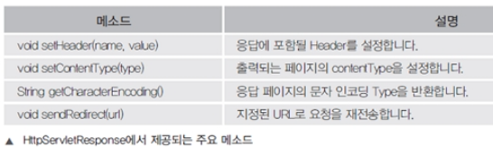
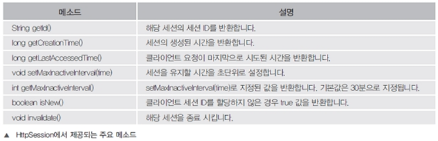

## JSP기본

* <%  %>  : 스크립틀릿 이라고 하고, 일반적인 java 코드가 쓰인다.

* <%= %> (표현식) : 하나만 선언하려고 할때 쓰임, 세미콜론(;) 쓰지 않아도 된다.

* <%!  %> : 선언문, 메소드와 멤버변수 선언

  * 특별한 경우만 사용하고 빈즈로 대체하여 잘 사용X

* 주석 :

  * <% 

    ​    //   : 한줄 주석    

    ​    /* */ : 여러줄 주석

       %>

* 내장객체 : 객체를 만드려면 class가 필요하다. 그러나 자동으로 객체가 생성되어있는 것(out.println 같은거), 바로 웹페이지에 사용할 수 있는 것

* <%@  %> (지시자) : 클라이언트의 요청에 JSP페이지가 실행이 될때 정보를 JSP 컨테이너에 알림
  * <%@ page import="java.util.*" %> : 패키지 선언
  *  <%@ include file="Local URL" %>  : 공통적으로 포함하는 내용이 있을 때, 같은 프로젝트 내에서 사용

---

* forward() : 페이지를 요청하면 아직 처리되지 않고 다른페이지로 이동. 마지막 JSP에서 request는 다 사라진다(대신 마지막 전까지는 request는 살아있다가 마지막에 사라짐).
* sendRedirect() : 데이터 처리를 한후 특정 페이지로 자동으로 주소 이동. 요청자체가 새로운 요청으로 바뀐다.한 번 동작이 되고 재요청되는거라서 새로운 요청객체가 생성되는 것.

---

* 웰컴파일 : Run on server했을때 html에서 따로 jsp요청안해도 켜지는 페이지(web-inf 파일경로)

## 서블릿

> 자바의 장점을 사용하지만, html, css, js과 연동 불가. WAS(톰캣)에서 동작으로 생성하여 결과를 전송해주는 서버 측 프로그램

* url 상으로 실행할 수 있다. parsing 되어짐

### 서블릿의 주요 클래스

* HttpServlet : 서블릿을 만들기 위해서 반드시 상속해야될 필수 클래스
* 다 콜백 메소드, 라이프 사이클 메소드다
  * void init() : 서블릿의 객체가 생성될때 호출되는 메소드, 객체가 생성되고 단 한번
  * void destoy() : 서블릿의 객체가 메모리에서해제 한번 호출되는 메소드
  * void service(request, response) : 서블릿의 요청이 있을때 호출되는 메소드
  * void doGet(request, response) : html에서 form의 메서드가 get일때 호출되는 메소드
  * void doPost(request, response) : html에서 메소드가 post일때 호출되는 메소드
* HttpServletRequest : 클라이언트가 데이터를 입력하거나 클라이언트의 정보에 대한 요청 값을 가지고 있다.
  * 

* HttpSession : 클라이언트가 세션정보를 저장하고, 세션 기능을 유지 하기 위해서 제공
  * 